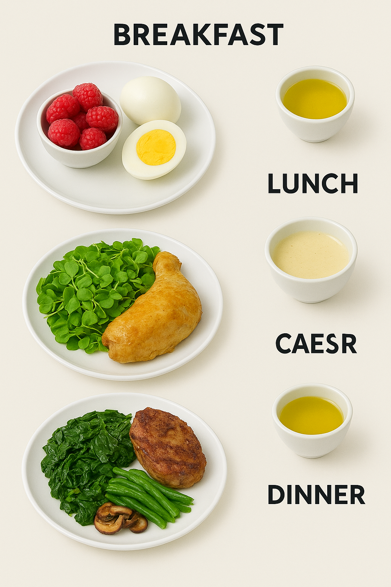
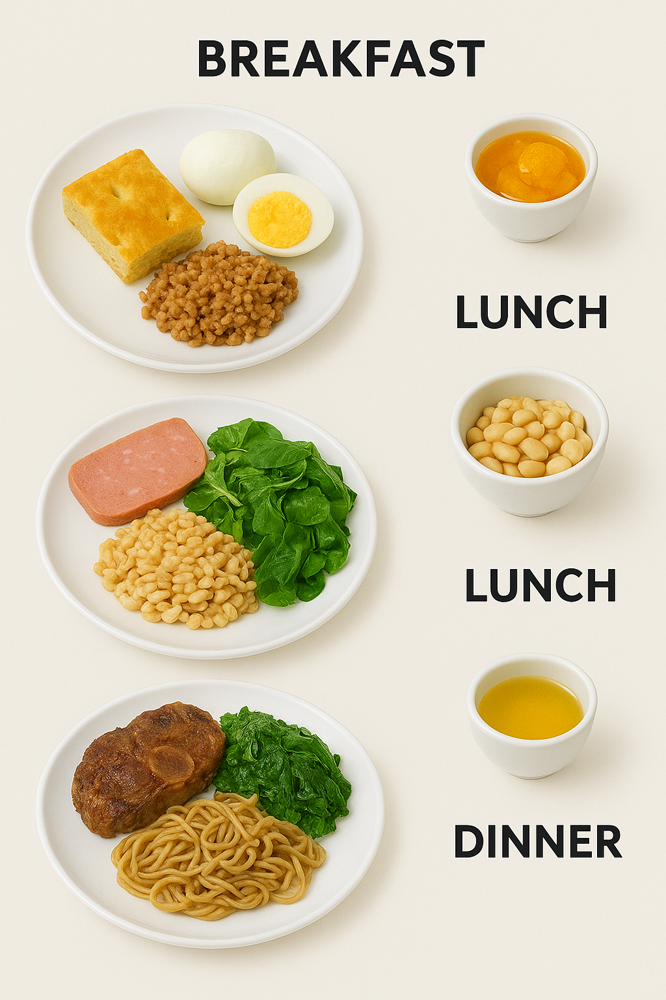

# Meal Composer

A Rails application that generates meal plans based on target macro-nutrient goals.

## Problem

People following specific diets (keto, low-carb, bodybuilding, etc.) need to hit precise macro-nutrient targets daily. Manually planning meals to achieve exact gram targets for carbohydrates, protein, and fat is time-consuming and often results in repetitive, boring meal plans.

## Solution

This app generates ingredient-based meal plans by:

- Taking user-specified macro targets (e.g., 50g carbs, 100g protein, 150g fat)
- Selecting foods from a comprehensive USDA nutrition database
- Ensuring meal variety by requiring specific food categories per meal, currently fixed at:
  - **Breakfast**: Dairy/eggs + cooking fats + fruits
  - **Lunch**: Poultry + cooking fats + vegetables
  - **Dinner**: Beef + cooking fats + vegetables
- Calculating precise portions to meet daily macro targets within tolerance
- Providing realistic, cookable meals (no raw meat without cooking fats)

**Note**: This app provides ingredient quantities per meal, not recipes. For example, the output tells you how much chicken, broccoli, and olive oil you need for lunch, but not how to prepare them. This approach is ideal for people who want macro-precise meal planning without complexity. You avoid detailed cooking instructions, long ingredient lists, and exotic spices or sauces you may not have on hand.

The app uses a constrained optimization algorithm that balances nutritional accuracy with meal palatability and variety.

## Requirements

- Docker and Docker Compose
- Ruby (version specified in `.ruby-version`)
- PostgreSQL client (version matching `docker-compose.yml`)

## Setup

1. **Start the database**:
   ```bash
   docker-compose up
   ```

2. **First-time setup** (in another terminal):
   ```bash
   bin/setup
   ```

3. **Start the development server**:
   ```bash
   bin/dev
   ```

The setup process will install dependencies, create the database, and load USDA nutrition data.

## Usage Examples

WIP: Update categories now that we're using FNDDS instead of Foundational Foods

If you want more than one of the same category at a meal, just include it twice. For example, the plan below will include two vegetables for dinner.

**Strict Keto**

```ruby
meal_structure = {
  breakfast: [ "Blueberries and other berries", "Butter and animal fats", "Eggs and omelets" ],
  lunch: [ "Other dark green vegetables", "Chicken, whole pieces", "Salad dressings and vegetable oils" ],
  dinner: [ "Beef, excludes ground", "Butter and animal fats", "Other vegetables and combinations", "Other dark green vegetables" ]
}
macro_targets = MacroTargets.new(carbs: 25, protein: 60, fat: 180)
result = FlexibleMealComposer.new.compose_daily_meals(
  macro_targets: macro_targets,
  meal_structure: meal_structure
)

if result.composed?
  puts result.daily_plan.pretty_print
else
  puts "Failed: #{result.error}"
end
```

Sample output: TODO Update after some foods cleanup

```
=== BREAKFAST ===
98.4g of Raspberries, raw
39.8g of Animal fat or drippings
93.5g of Egg, whole, boiled or poached
Breakfast macros: carbs=14.0g, protein=13.0g, fat=46.0g

=== LUNCH ===
99.8g of Cress, raw
97.9g of Chicken leg, drumstick and thigh, stewed, skin not eaten
98.1g of Caesar dressing
Lunch macros: carbs=9.0g, protein=28.0g, fat=65.0g

=== DINNER ===
75.0g of Beef, NFS
75.0g of Fat back, cooked
75.0g of Seaweed, cooked, no added fat
75.0g of Turrnip greens, NS as to form, cooked
Dinner macros: carbs=9.0g, protein=26.0g, fat=74.0g

=== DAILY TOTALS ===
Target: 25.0g carbs, 60.0g protein, 180.0g fat
Actual: 31.0g carbs, 68.0g protein, 185.0g fat
Difference: carbs 6.0g, protein 8.0g, fat 5.0g
Within tolerance: true
```

Visual from ChatGPT - needs update after switch to FNDDS



**High Protein Athlete**

```ruby
meal_structure = {
  breakfast: [
    "Eggs and omelets",
    "Grits and other cooked cereals",
    "Citrus fruits",
    "Yeast breads"
  ],
  lunch: [
    "Cold cuts and cured meats",
    "Lettuce and lettuce salads",
    "Beans, peas, legumes",
    "Rice"
  ],
  dinner: [
    "Beef, excludes ground",
    "Other dark green vegetables",
    "Pasta, noodles, cooked grains",
    "Other red and orange vegetables"
  ]
}
macro_targets = MacroTargets.new(carbs: 250, protein: 180, fat: 70)
result = FlexibleMealComposer.new.compose_daily_meals(
  macro_targets: macro_targets,
  meal_structure: meal_structure
)
if result.composed?
  puts result.daily_plan.pretty_print
else
  puts "Failed: #{result.error}"
end
```

Sample output:

```
=== BREAKFAST ===
242.3g of Egg, white, cooked, fat added
93.2g of Wheat cereal, chocolate flavored, cooked
65.3g of Orange, canned, in syrup
140.6g of Focaccia, Italian, plain
Breakfast macros: carbs=75.0g, protein=39.0g, fat=25.0g

=== LUNCH ===
170.8g of Beef, prepackaged or deli, luncheon meat, reduced sodium
91.6g of Mixed salad greens, raw
194.6g of White beans, from dried, fat added
163.6g of Rice, brown and wild, cooked, fat added
Lunch macros: carbs=89.0g, protein=55.0g, fat=25.0g

=== DINNER ===
191.7g of Beef, oxtails
118.0g of Mustard greens, raw
198.2g of Noodles, whole grain, cooked
131.9g of Sweet potato, baked, no added fat
Dinner macros: carbs=89.0g, protein=67.0g, fat=36.0g

=== DAILY TOTALS ===
Target: 250.0g carbs, 180.0g protein, 70.0g fat
Actual: 253.0g carbs, 161.0g protein, 86.0g fat
Difference: carbs 3.0g, protein -19.0g, fat 16.0g
Within tolerance: false
```

Visual from ChatGPT TODO needs update after fndds foods



## Current Status

Early development. The algorithm successfully generates meal plans within macro tolerances but may require multiple attempts for very restrictive targets.

The meal structures can be customized wrt categories at each meal, with exactly one food per category. Future versions may include flexibility to customize the number of meals per day and the number of foods from each category within each meal.

## Reference Data

[FoodData Central Download Datasets](https://fdc.nal.usda.gov/download-datasets)
