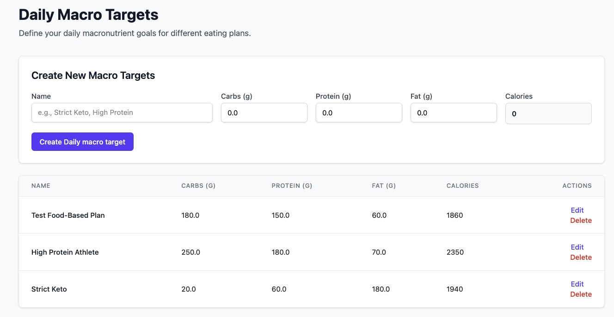
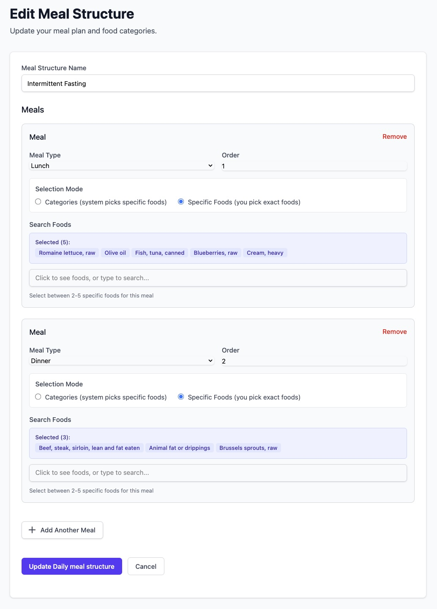
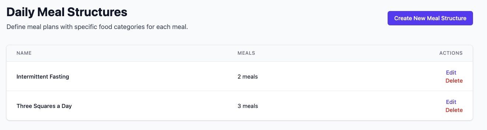
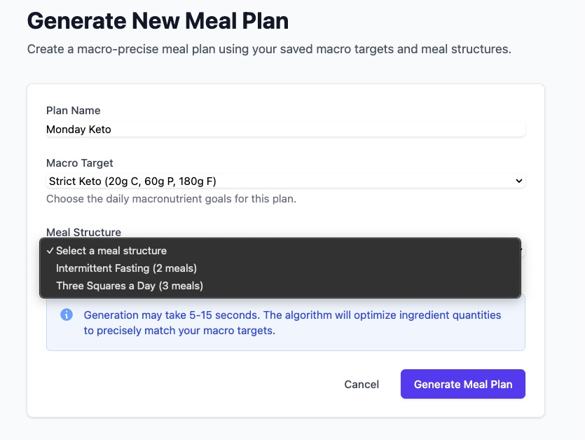
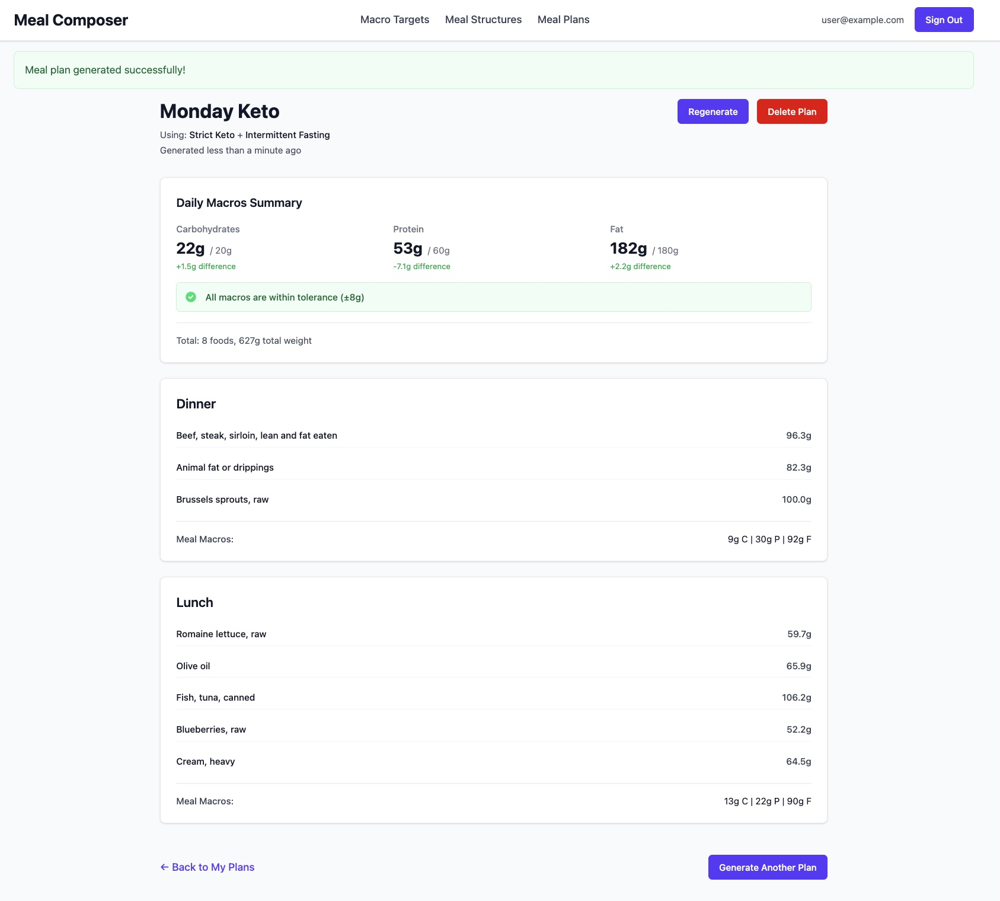

# Meal Composer

A Rails application that generates meal plans based on target macro-nutrient goals.

## Problem

People following specific diets (keto, low-carb, bodybuilding, etc.) need to hit precise macro-nutrient targets daily. Manually planning meals to achieve exact gram targets for carbohydrates, protein, and fat is time-consuming and often results in repetitive, boring meal plans.

## Solution

This app generates ingredient-based meal plans by:

- Taking user-specified macro targets (e.g., 50g carbs, 100g protein, 150g fat)
- Selecting foods from a comprehensive USDA nutrition database
- Ensuring meal variety by requiring specific food categories per meal, currently fixed at:
  - **Breakfast**: Dairy/eggs + cooking fats + fruits
  - **Lunch**: Poultry + cooking fats + vegetables
  - **Dinner**: Beef + cooking fats + vegetables
- Calculating precise portions to meet daily macro targets within tolerance
- Providing realistic, cookable meals (no raw meat without cooking fats)

**Note**: This app provides ingredient quantities per meal, not recipes. For example, the output tells you how much chicken, broccoli, and olive oil you need for lunch, but not how to prepare them. This approach is ideal for people who want macro-precise meal planning without complexity. You avoid detailed cooking instructions, long ingredient lists, and exotic spices or sauces you may not have on hand.

The app uses a constrained optimization algorithm that balances nutritional accuracy with meal palatability and variety.

## Requirements

- Docker and Docker Compose
- Ruby (version specified in `.ruby-version`)
- PostgreSQL client (version matching `docker-compose.yml`)

## Setup

1. **Start the database**:
   ```bash
   docker-compose up
   ```

2. **First-time setup** (in another terminal):
   ```bash
   bin/setup
   ```

3. **Start the development server**:
   ```bash
   bin/dev
   ```

The setup process will install dependencies, create the database, and load USDA nutrition data.

## Usage Examples

**Step 1: Define Daily Macro Targets**



**Step 2: Define Meal Structure**





**Step 3: Generate Meal Plan**





## Current Status

Early development, experimental. The algorithm successfully generates meal plans within macro tolerances but may require multiple attempts for very restrictive targets.

## Reference Data

[FoodData Central Download Datasets](https://fdc.nal.usda.gov/download-datasets)
